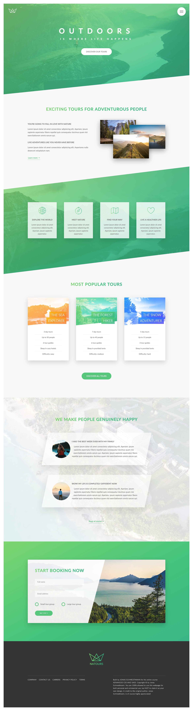

Natours Landing Page - Learn CSS by example

"CSS is hard 😓", "How can I get better at CSS 🤔?", "I get stuck on little CSS issues 😢", "I Copy & Paste CSS from stack overflow 🤮. 

Do any of these expressions describe you? If yes, we both are on the same boat. I have decided to improve my relationship with CSS in 2021. 

I have started creating tiny projects on Codepen & added most of them to git. These projects are inspired from great work done by Jonas Schmedtmann.

Here is the work showcasing my love for CSS. 

[Demo](https://natours-advanced-css.netlify.app/)  

Following CSS Learnings are included as part of this page development.

1. Advanced CSS 
2. BEM (Block Element Modifier)
3. Transitions, Clip-path, Animations
4. Color-gradients
5. Background Images, 
6. Background Videos 
7. SaSS Variables, Mixins, Functions etc.
8. Semantic Markup
9. Font Icons
10. Responsive Web Design and many more....

